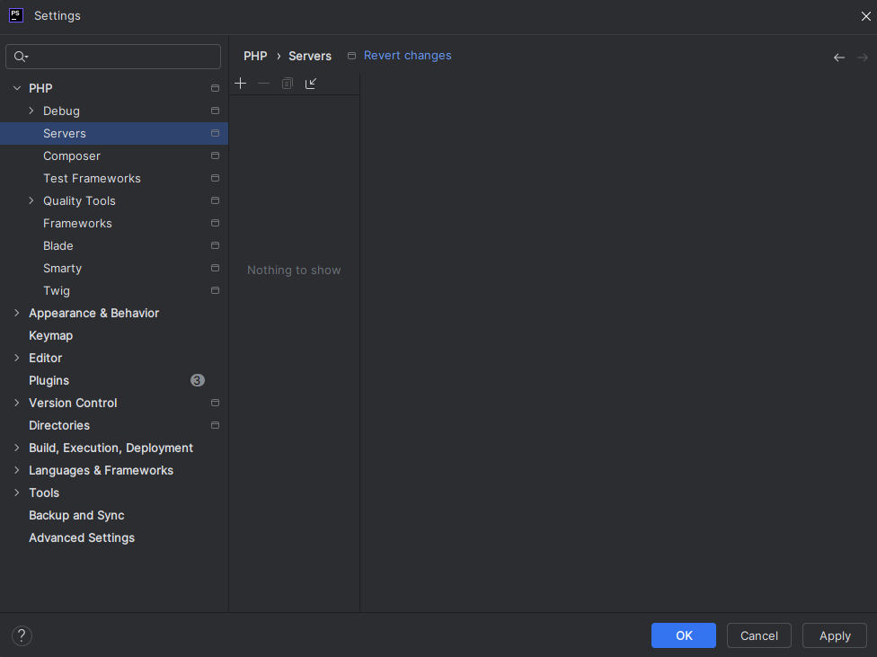
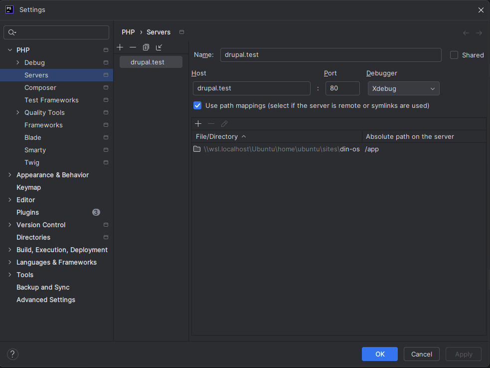
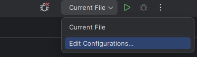
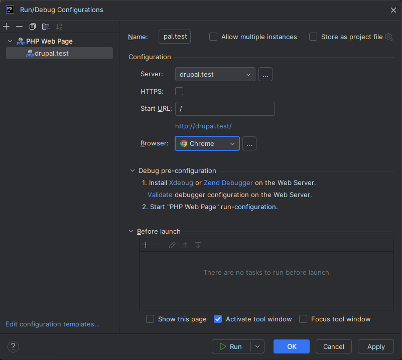

# Drupal - Configurer XDebug

**Xdebug** est une extension **PHP** qui permet d’analyser et de déboguer du code en offrant des fonctionnalités 
comme le pas à pas, l’inspection des variables et le profilage des performances.

## Dans PHPStorm

Créez un serveur dans la configuration de PHPStorm en vous rendant dans `Settings->PHP->Servers`, puis cliquez sur
l'icone `+`.

Entrez les informations suivantes : 
- **Name**: drupal.test
- **Host**: drupal.test
- **Port**: 80
- **Debugger**: Xdebug
- **Use path mappings** (cocher la case)
- **Absolute path on the server**: ajouter "/app" pour la ligne "Project files"

> ⚠️ Le "Host" `drupal.test` correspond à la valeur précisée dans le fichier *compose.yml* pour la variable
> `PHP_IDE_CONFIG`. Par convention, je garde la même valeur pour le champ "Name".

Dans la barre du haut, cliquez sur `Current File`, puis sur `Edit Configurations`.

Cliquez sur `+` pour ajouter une nouvelle configuration et choisissez `PHP web page`.

Remplissez le formulaire avec les informations suivantes : 
- **Name**: drupal.test
- **Server**: drupal.test (le serveur que nous venons de créer)
- **HTTPS**: ne cochez pas la case
- **Start URL**: /
- **Browser**: Sélectionnez votre navigateur préféré ou laissez "default".

Pour activer **XDebug**, il suffit maintenant de cliquer sur l'icone `Debug` dans la barre du haut. Ce qui va
ouvrir le site sur le navigateur.