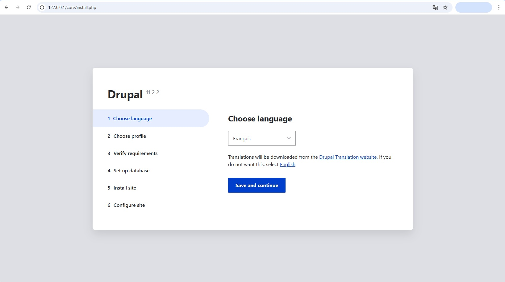
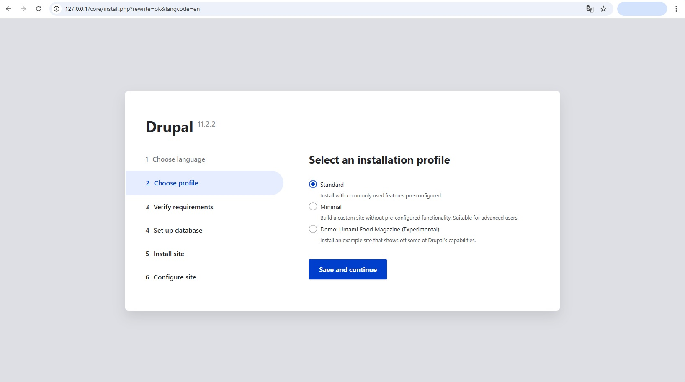
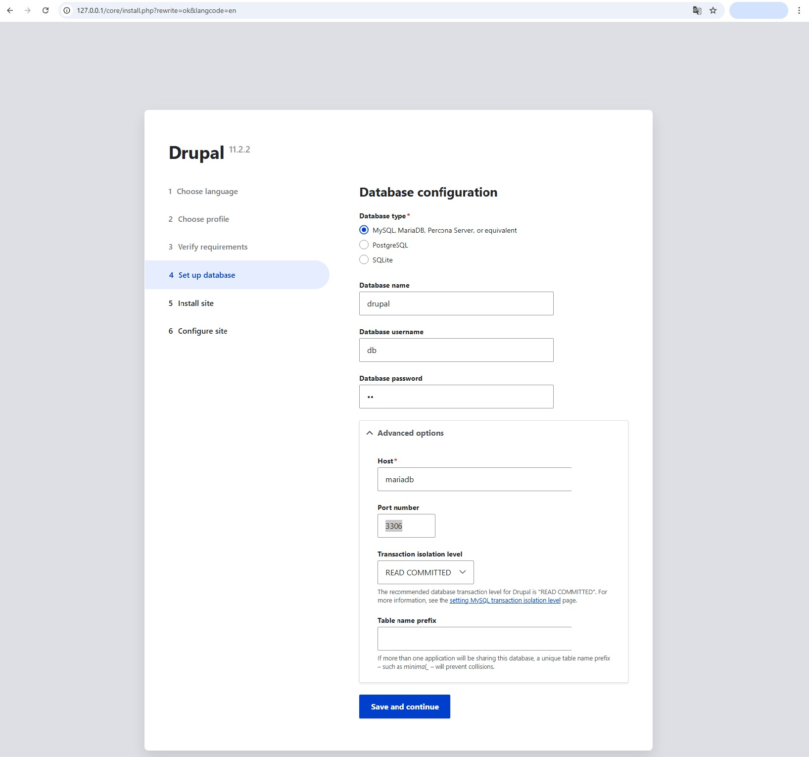
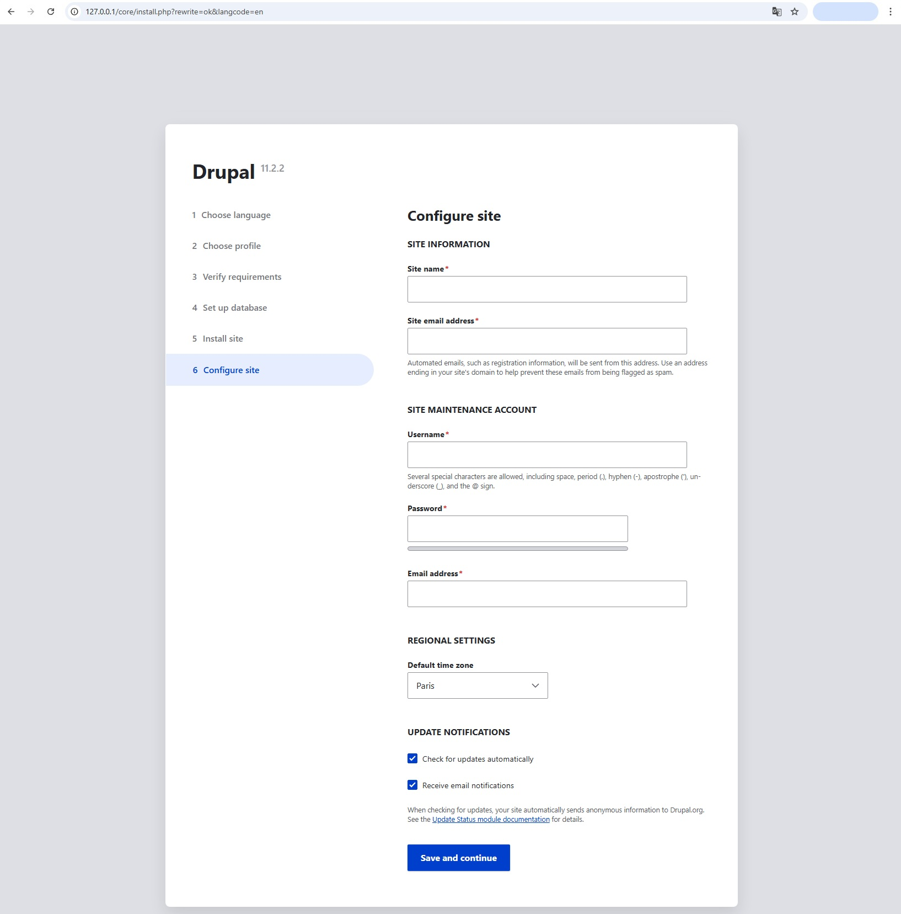
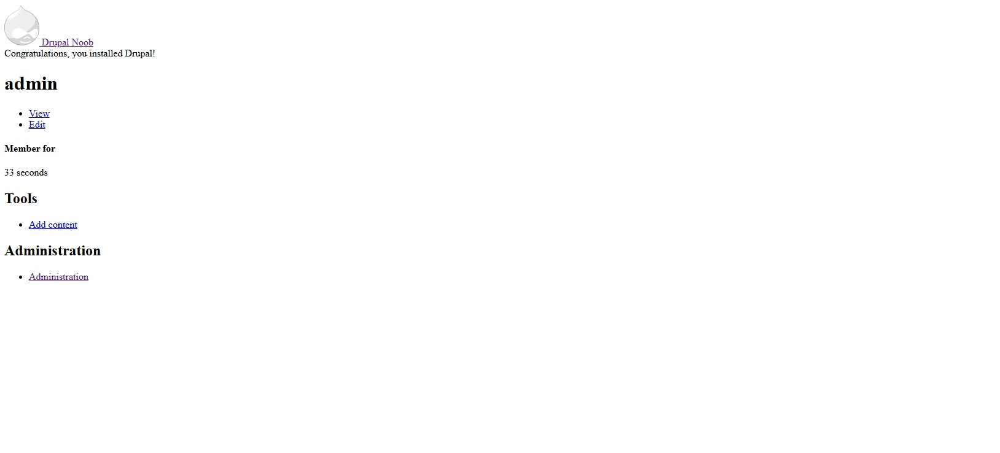

# Drupal - Installation via Composer

## Présentation de Composer

**Composer** est le gestionnaire de dépendances standard de **PHP**, similaire à **npm** pour **JavaScript** ou **pip** pour **Python**.
Il permet de télécharger et installer automatiquement les bibliothèques et frameworks **PHP** nécessaires à notre projet,
en gérant leurs versions et leurs interdépendances.

Dans le contexte de Drupal, **Composer** facilite grandement l'installation du core, des modules contributifs et des
thèmes, tout en maintenant une structure de projet cohérente et en simplifiant les mises à jour.

Comme nous l'avons configuré dans un tutoriel précédent, notre environnement de développement repose sur **Docker** avec
plusieurs conteneurs dédiés. Dans cette configuration, **Composer** est automatiquement disponible grâce à
l'image Docker `webdevops/php-apache-dev` que nous utilisons pour notre conteneur **PHP**.

Cette image préconfigurée inclut non seulement **PHP** et **Apache**, mais également **Composer** installé globalement,
ce qui nous évite d'avoir à l'installer manuellement dans notre conteneur.

## Installation

Si ce n'est déjà fait, démarrez le container `dev` avec la commande :
```shell
make dev
```

Pour utiliser **Composer**, nous devons nous connecter à notre container en shell.
```shell
make shell
```

Si vous souhaitez vérifier que **Composer** est bien présent dans notre container, vous pouvez simplement taper la commande :
```shell
composer
```

Quelque chose comme ceci devrait s'afficher avec ensuite la liste de toutes les commandes disponibles.

```shell
   ______
  / ____/___  ____ ___  ____  ____  ________  _____
 / /   / __ \/ __ `__ \/ __ \/ __ \/ ___/ _ \/ ___/
/ /___/ /_/ / / / / / / /_/ / /_/ (__  )  __/ /
\____/\____/_/ /_/ /_/ .___/\____/____/\___/_/
                    /_/
Composer version 2.8.9 2025-05-13 14:01:37
```

Tout est prêt, nous pouvons lancer l'installation de **Drupal**. Tapez la commande suivante :
```shell
composer create-project drupal/recommended-project drupal-temp
```

Cette commande télécharge et installe la dernière version stable de **Drupal** avec toutes ses dépendances dans un dossier
temporaire (que nous avons défini à *drupal-temp*).

A la fin de la procédure, **Composer** affiche le message suivant :

```shell
  Congratulations, you’ve installed the Drupal codebase
  from the drupal/recommended-project template!


Next steps:
  * Install the site: https://www.drupal.org/docs/installing-drupal
  * Read the user guide: https://www.drupal.org/docs/user_guide/en/index.html
  * Get support: https://www.drupal.org/support
  * Get involved with the Drupal community:
      https://www.drupal.org/getting-involved
  * Remove the plugin that prints this message:
      composer remove drupal/core-project-message
  * Homepage: https://www.drupal.org/project/drupal
  * Support:
    * docs: https://www.drupal.org/docs/user_guide/en/index.html
    * chat: https://www.drupal.org/node/314178
```

Parmi les liens utiles vers la documentation, on nous conseille de supprimer le module qui affiche ce message. 

Mais avant de pouvoir supprimer le module, nous devons déplacer les dossiers et fichiers qui viennent d'être installés.

Par mesure de sécurité et afin d'éviter d'écraser des données existantes, **Composer** n'accepte pas d'installer un projet
dans un répertoire qui contient déjà des fichiers. C'est pour cette raison que nous effectuons l'installation dans un
dossier temporaire.

Une fois l'installation terminée, nous allons donc transférer tous les dossiers à la racine. Utilisez la commande
suivante :

```shell
rsync -a drupal-temp/ ./
rm -rf drupal-temp/
```

Une fois les dossiers et fichiers transférés, nous pouvons supprimer le module temporaire avec la commande suivante :
```shell
composer remove drupal/core-project-message
```

Et voilà, l'installation de Drupal est terminée !

Enfin... pas tout à fait.

## Initialisation du site Drupal

L'installation de **Drupal** via **Composer** avec la commande `create-project` ne constitue que la première étape du processus
de mise en place d'un site **Drupal** fonctionnel. Cette commande télécharge uniquement les fichiers source du framework et ses
dépendances **PHP**, mais elle ne crée pas encore un site opérationnel.

Pour finaliser cette installation, **Drupal** propose une interface graphique. Sur votre navigateur préféré, rendez-vous
à l'adresse `127.0.0.1`.

### 1.Choose language


*Initialisation de Drupal - Choisir la langue*

Ce premier écran de l'initialisation de **Drupal** vous propose de sélectionner la langue, avec le français sélectionné par
défaut.

Bien qu'il soit tentant d'installer directement **Drupal** dans sa langue natale, je recommande de procéder à
l'installation initiale en anglais. Il est bien entendu possible de télécharger des packs de langues par la suite.

Les raisons sont :
- **Traductions incomplètes** : certains textes peuvent rester en anglais si les traductions ne sont pas à 100%.
- **Modules contribués** : beaucoup n'ont pas de traductions françaises disponibles immédiatement.
- **Formation simplifiée** : de nombreux tutos sont en anglais, il sera plus simple de suivre ces tutos avec une interface identique.
- **Debug plus simple** : les messages d'erreurs seront en anglais ce qui facilite la recherche sur **Google** ou la documentation.

Il n'y a pas vraiment de risque ou de problème à charger une autre langue que l'anglais. Je trouve juste cela plus pratique.

Je vous invite donc à choisir "English" dans la liste et de valider le formulaire en cliquant sur le bouton "Save and continue".

### 2.Choose profile


*Initialisation de Drupal - Choisir le profil*

Cet écran de l'initialisation nous propose de choisir quel profil d'installation nous souhaitons utiliser pour la configuration
de base de notre site. Chaque profil pré-configure différents modules, types de contenu, rôles utilisateurs et paramètres
selon un usage spécifique.

- **Standard** : configuration polyvalente avec des fonctionnalités courantes (articles, pages, commentaires, taxonomie).
Idéal pour la plupart des sites web classiques.
- **Minimal** : installation très légère avec seulement les modules indispensables. Parfait lorsque l'on souhaite construire
notre site de zéro.
- **Demo Umami Food Magazine** : site de démonstration pré-rempli avec du contenu d'exemple. Utile pour découvrir les
possibilités de Drupal ou comme base pour un site magazine.

Par défaut j'aurais tendance à proposer le profil **Standard**. Mais pour cette formation nous allons effectuer l'installation
avec le profil **Minimal**.

La première raison est que ça nous donnera l'occasion de voir un à un tous les modules principaux à la création d'un site
internet.

Et surtout, dans le cas où plusieurs développeurs auront à travailler sur le même projet **Drupal**, il faut pouvoir permettre
l'installation à partir de configuration existante. Et ce n'est possible qu'en effectuant une installation minimale. (Sans avoir
à effectuer des modifications dans les fichiers de configs).

Choisissez "Minimal" et validez le formulaire en cliquant sur "Save and continue".

### 3.Verify requirements

Vous n'avez rien à faire durant cette étape. Elle est d'ailleurs automatiquement validée.

### 4.Set up database


*Initialisation de Drupal - Configurer la base de données*

Cette étape permet de configurer la base de données qui sera utilisée par **Drupal**.

Pour ça nous allons utiliser les identifiants que nous avons dans le fichier `.docker/.env`.

- Database type : MySQL, MariaDB, Percona Server, or equivalent
- Database name : drupal
- Database username : db
- Database password : db

Ouvrez ensuite la section "Advanced options".

- Host : mariadb
- Port number : 3306
- Transaction isolation level : READ COMMITED
- Table name prefix : *laissez vide*

Le choix du `Host` est dicté par notre configuration Docker. Rappelez-vous, nous avons
appelé `mariadb` le service qui gère la base de données.

Concernant la configuration `Transaction isolation level`, cette ligne fait référence au niveau d'isolation des transactions
de la base de données, un paramètre important pour la gestion de la concurrence. Avec plusieurs utilisateurs connectés
simmultanément sur le site Drupal, ce paramètre garantit que les données lues sont fiables et cohérentes, tout en maintenant
de bonnes performances.

Et enfin la configuration `Table name prefix`, qui permet de rajouter un préfix aux noms des tables dans la base, n'a d'utilité
que dans le cas où plusieurs sites sont hébergés dans la même base de données. Ce qui n'est pas notre cas.

Vous pouvez valider le formulaire en cliquant sur "Save and continue".

### 5.Install site

Vous n'avez rien à faire durant cette étape. Elle est d'ailleurs automatiquement validée.

### 6.Configure site


*Initialisation de Drupal - Configurer le site*

Dernière étape de l'initialisation de notre projet Drupal.

Il ne reste plus qu'à indiquer les informations de notre site internet. Je pense que cet écran se suffit à lui-même
pour le comprendre.

Une fois les informations entrées, validez le formulaire en cliquant sur "Save and continue".

## Félicitation


*Initialisation de Drupal - Fin d'installation*

Votre site **Drupal** est désormais installé et initialisé... et qu'est-ce qu'il est moche !

Mais ne vous inquiétez pas, c'est tout à fait normal. N'oubliez pas que nous avons effectué une installation minimale.
Nous n'avons donc pas de contenu, ni de templates, ni de modules, etc..

Avant de nous occuper de tout ça faisons un point sur cette installation.
