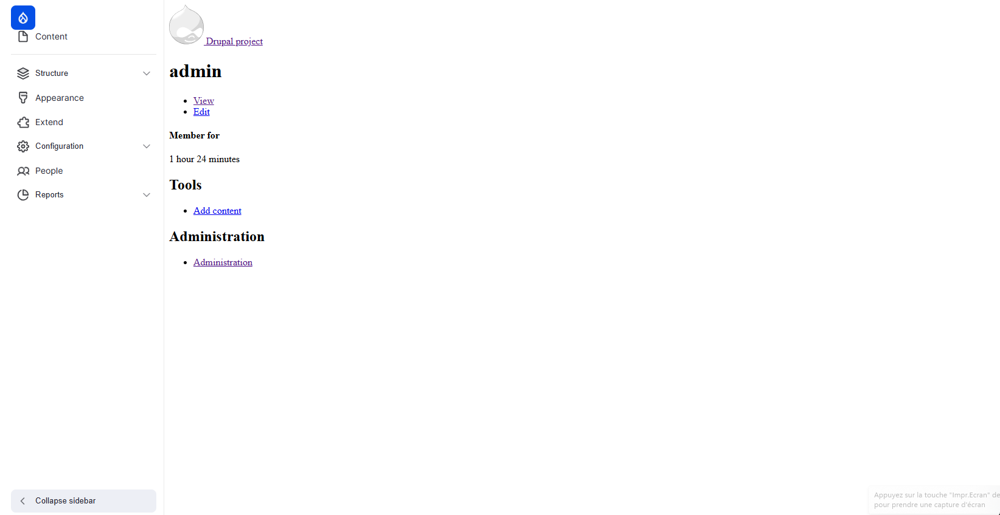
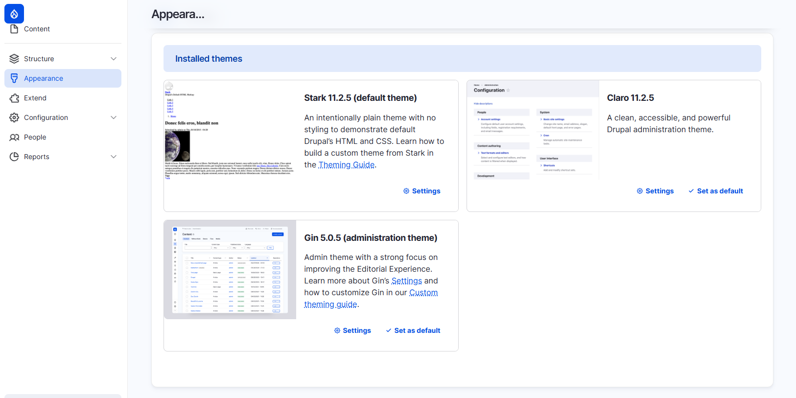
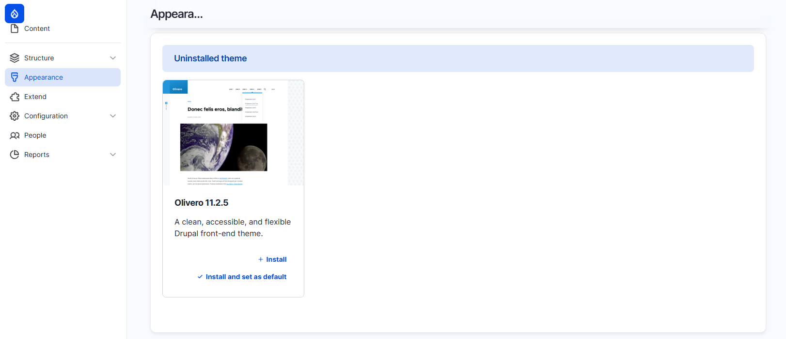
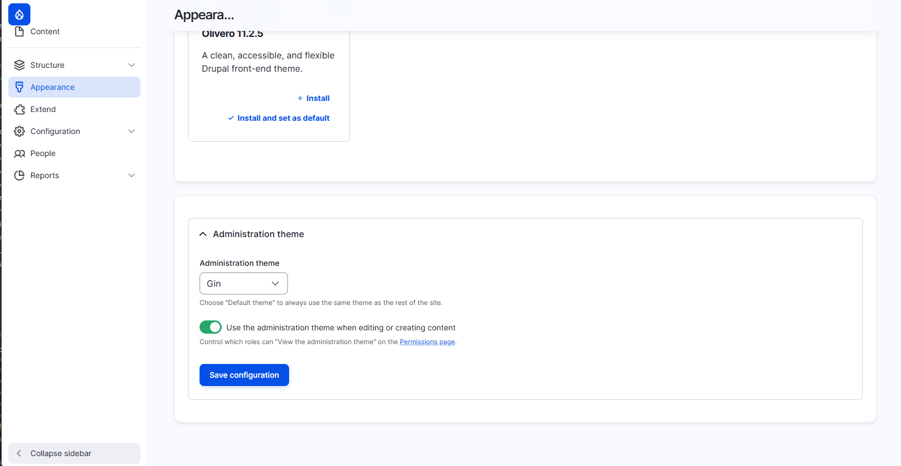
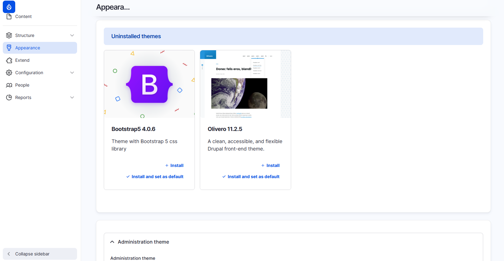
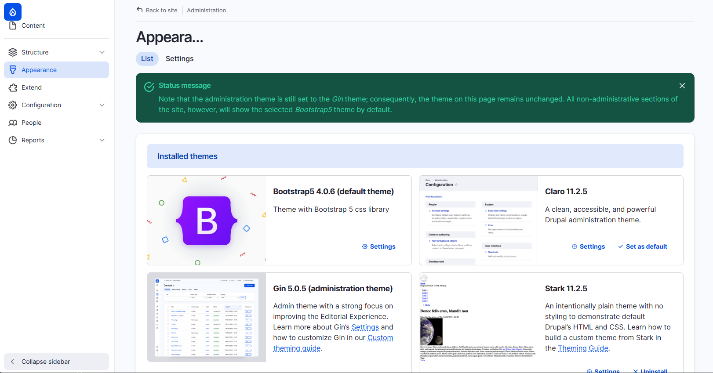
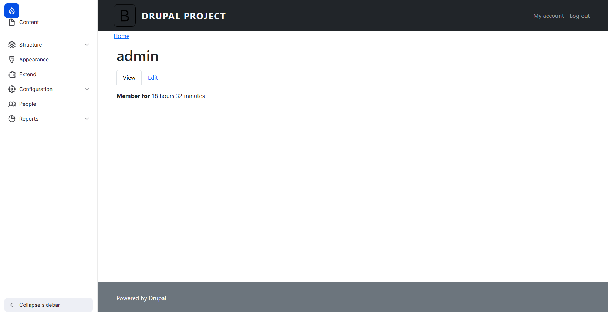

# Installation de thèmes

Présentation que nous allons voir l'installation de thème en deux façons : 
- en utilisant Drush.
- Dans l'administration de Drupal.

## Thème admin avec Drush

Présentation des thèmes admin : gin

Installation avec composer et Drush

```shell
composer require drupal/gin
```

Ce qui va installer gin et gin_toolbar.

Tout comme pour les modules, l'installation d'un thème se fait en deux étapes : 
- l'installation des fichiers.
- l'activation dans Drupal.

Activer le thème : 
```shell
drush theme:enable gin
```

La commande demande de confirmer.


Définir le thème pour l'administration :
```shell
drush config:set system.theme admin gin
```

Activer gin toolbar
```shell
drush en gin_toolbar
```



Bon, notre site est toujours un peu moche mais maintenant nous avons une barre de navigation latérale pour le menu administrateur.

## Thème par défaut dans l'admin

Aller dans Admin -> Appearance

La zone est divisée en trois parties : 
- les thèmes installés



Nous pouvons voir qu'il y a déjà trois thèmes d'installés et que Stark est le thème par défaut.
Expliquer pourquoi le site reste moche malgré le thème Stark.

- les thèmes désinstallés



- le thème de l'administration



Nous allons commencer par ajouter un nouveau thème : Bootstrap5.

```shell
composer require drupal/bootstrap5
```

Maintenant si on actualise la page nous voyons que le thème Bootstrap5 est présent dans les thèmes désinstallés.



Nous pouvons cliquer sur "Install and set as default".

Le thème Bootstrap5 est maintenant installé et considéré par défaut.



Si nous cliquons sur "Back to site" pour quitter l'administration nous pouvons voir que notre site est maintenant en Bootstrap5.



Les thèmes que l'on vient d'installer sont maintenant visible dans le dossier *web/themes/contrib*

```
├── web/
│   ├── core
│   ├── modules
│   ├── sites
│   └── themes/
│       ├── bootstrap5
│       └── gin
```