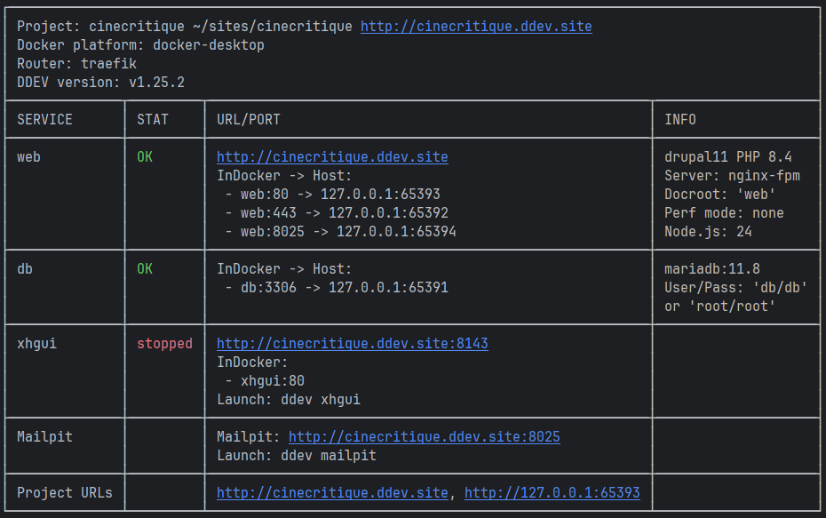

# Installer Drupal avec DDEV et Composer

Comme vu dans le chapitre précédent, nous allons utiliser **DDEV** pour mettre en place un environnement de développement.

## Configurer le projet

Nous allons maintenant utiliser **DDEV** pour initialiser un projet **Drupal**. Tapez la commande suivante : 

```shell
ddev config --project-type=drupal11 --docroot=web
```

Cette commande crée un dossier *.ddev/* contenant toute la configuration de votre environnement :

``` 
mon-projet/
└── .ddev/
    ├── config.yaml      ← Configuration principale du projet
    └── ...
```

::: info ❓ Que font ces options ?
`--project-type=drupal11` : indique à **DDEV** que nous allons utiliser **Drupal 11**. Il adaptera automatiquement la configuration
(version de **PHP**, paramètres du serveur…).

`--docroot=web` : définit le dossier *web/* comme racine du serveur web. C'est la convention utilisée par **Drupal** pour séparer
les fichiers publics du reste du projet.
:::

Le dossier *web/* est également créé, il contient pour le moment les fichiers de configuration de **Drupal**.

``` 
mon-projet/
├── .ddev/
└── web/
    └── sites/default/
        ├── .gitignore
        ├── settings.ddev.php
        └── settings.php
```

## Démarrer DDEV
Lancez le démarrage de l'environnement :

``` shell
ddev start
```

::: warning ⚠️ Collecte de données anonymes
Lors de la première utilisation de **DDEV**, un message peut apparaître :

`It looks like you have a new DDEV release. Permission to beam up?`

**DDEV** vous demande la permission d'envoyer des statistiques d'utilisation anonymes et des rapports d'erreurs à
l'équipe de développement. Ces données les aident à améliorer l'outil.

Ce choix n'a aucun impact sur le fonctionnement de **DDEV**. Vous pouvez choisir l'option qui vous convient.

Tapez `Y` pour accepter l'envoi de données anonymes. Tapez `n` pour refuser.
:::


Lors du premier démarrage, **DDEV** va :
* 📥 Télécharger les images Docker nécessaires (serveur web, base de données…)
* 🐳 Créer les conteneurs pour votre projet
* 🌐 Configurer le réseau et les certificats HTTPS
* 🔗 Attribuer une URL locale à votre projet

::: warning Le premier démarrage peut prendre plusieurs minutes selon votre connexion internet.
Les lancements suivants seront beaucoup plus rapides car les images **Docker** seront déjà en cache.
:::

Une fois le démarrage terminé, **DDEV** affiche un récapitulatif :

``` 
Successfully started mon-projet
Project can be reached at https://mon-projet.ddev.site
```

Vous pouvez vérifier que tout fonctionne avec :

``` shell
# Afficher les informations du projet
ddev describe
```


*Description DDEV de notre projet*

Cette commande affiche les informations sur le projet courant, notamment les URL locales disponibles,
les ports mappés, les conteneurs en cours d'exécution, etc..

Ouvrir le projet dans le navigateur

```shell
ddev launch
```

::: warning À ce stade, le navigateur affichera une page d'erreur 403
C'est normal ! **Drupal** n'est pas encore installé.
:::

## Le point sur Composer

**Composer** est le gestionnaire de dépendances standard de **PHP**, similaire à **npm** pour **JavaScript** ou **pip** pour **Python**.
Il permet de télécharger et installer automatiquement les bibliothèques et frameworks **PHP** nécessaires à notre projet,
en gérant leurs versions et leurs interdépendances.

Dans le contexte de Drupal, **Composer** facilite grandement l'installation du core, des modules contributifs et des
thèmes, tout en maintenant une structure de projet cohérente et en simplifiant les mises à jour.

### Composer est-il disponible ?

**Composer** est directement disponible dans l'environnement **DDEV**, sans aucune installation supplémentaire.
Cela signifie que dès que votre projet **DDEV** est lancé, vous pouvez exécuter vos commandes **Composer** habituelles.

Si vous souhaitez vérifier que **Composer** est bien présent dans notre container, vous pouvez simplement taper la commande :

```shell
ddev composer
```

Quelque chose comme ceci doit s'afficher avec ensuite la liste de toutes les commandes disponibles.

```shell
   ______
  / ____/___  ____ ___  ____  ____  ________  _____
 / /   / __ \/ __ `__ \/ __ \/ __ \/ ___/ _ \/ ___/
/ /___/ /_/ / / / / / / /_/ / /_/ (__  )  __/ /
\____/\____/_/ /_/ /_/ .___/\____/____/\___/_/
                    /_/
Composer version 2.9.7 2026-04-14 13:31:52
```

## Bon, on installe Drupal ou bien ?!?

**DDEV** est configuré, nous avons **Composer**, nous pouvons maintenant installer **Drupal** avec la commande suivante :

```shell
ddev composer create-project drupal/recommended-project
```

**Composer** va maintenant installer Drupal ainsi que toutes les librairies nécessaires. A la fin de la procédure, le 
terminal affichera ce message : 

```shell
ddev composer create-project was successful. 
```

::: info Et c'est tout ?
En quelques commandes, nous avons généré un environnement de développement local et installé **Drupal** !

Mais notre projet **Drupal** n'est pas encore prêt à être utilisé. Nous devons maintenant 
[initialiser notre site](/ddev/init).
:::