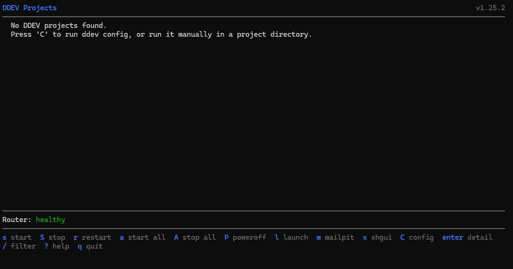
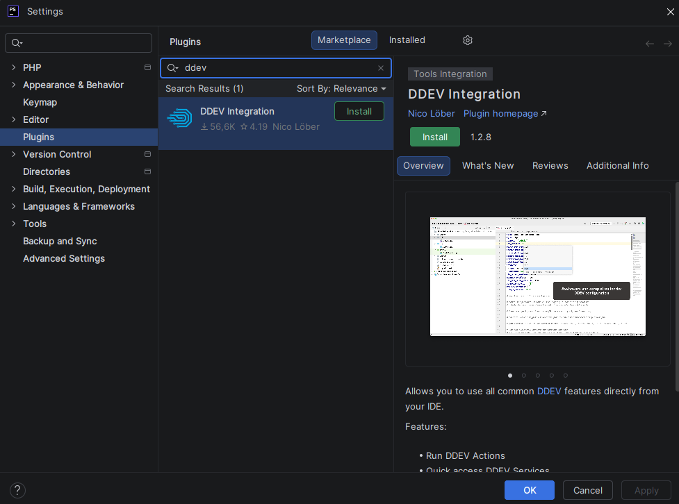

#  DDEV

## Qu'est-ce que DDEV ?

**DDEV** est un outil open source qui permet de créer des environnements de développement locaux en quelques minutes,
basé sur **Docker**. Il est conçu pour simplifier radicalement la mise en place d'un projet web 
(**Drupal**, **WordPress**, **Laravel**, etc.)
sans avoir à configurer manuellement chaque service (serveur web, base de données, **PHP**, etc.).

En résumé : **DDEV** fait tout le travail de configuration **Docker** à votre place.

Pas besoin de mettre en place manuellement chaque service, des fichiers de configuration,
des makefiles pour simplifier les workflows, etc.. **DDEV** fait tout.

## Prérequis

Nous avons besoin d'un fournisseur **Docker** sur notre système avant de pouvoir installer **DDEV**.

Pour plus d'informations sur les fournisseurs **Docker**, en fonction de votre système,
consulter la [Documentation DDEV](https://docs.ddev.com/en/stable/users/install/docker-installation/).

## Installation

La [Documentation DDEV](https://docs.ddev.com/en/stable/users/install/ddev-installation/) est très claire sur comment
installer **DDEV**.

Ayant déjà un fournisseur **Docker** installé sur mon système **Windows** (**Docker Desktop** avec la distribution *Ubuntu*), j'ai suivi
les étapes suivantes :

* J'ai téléchargé l'installeur de **DDEV** pour **Windows** (architecture AMD64).
* Durant l'installation, j'ai sélectionné *Ubuntu* comme distribution.

L'installeur a automatiquement configuré **DDEV** par rapport à mon fournisseur Docker.

Pour vérifier l'installation, ouvrir une invite de commande dans WSL2 (interpréteur de commandes Linux) et exécuter
la commande suivante :

```shell
ddev
```

Le terminal doit afficher le dashboard de **DDEV**.


*DDEV dashboard*

::: tip 💡 Quitter le dashboard
Pour quitter le dashboard, appuyer sur la touche `q`.
:::

## Plugin PHPStorm

Si vous utilisez **PHPStorm** comme IDE, sachez qu'un plugin est disponible : **DDEV Integration**.

Ce plugin apporte les fonctionnalités suivantes : 

* **Complétion** : *config.yaml* de **DDEV** est automatiquement détecté. De l'autocomplétion et des suggestions 
sont proposées.
* Intégration dans le **terminal** : Possibilité de se connecter directement dans le container **DDEV** 
dans le terminal. Cliquez sur la flèche pour sélectionner le type de terminal et choisissez *DDEV web container*.
* Configuration de la **Base de données** : dès le démarrage de l'IDE, une connexion à la base de données
est automatiquement faites avec l'utilisateur `db`. Cette connexion est visible dans la fenêtre *Database*.

Pour l'installer, rendez-vous dans "Settings -> Plugins -> Marketplace" et cherchez **DDEV Integration**.


*Plugin DDEV Integration dans PHPStorm*

Cliquez ensuite sur "Install", puis sur "Apply" et "OK" pour fermer la fenêtre. **PHPStorm** devrait détecter automatiquement
**DDEV**.

::: info Pour le moment, nous n'avons aucun projet **DDEV** configuré.
Nous allons tout de suite y remédier et installer **Drupal** dans [la prochaine étape](/ddev/drupal)
:::