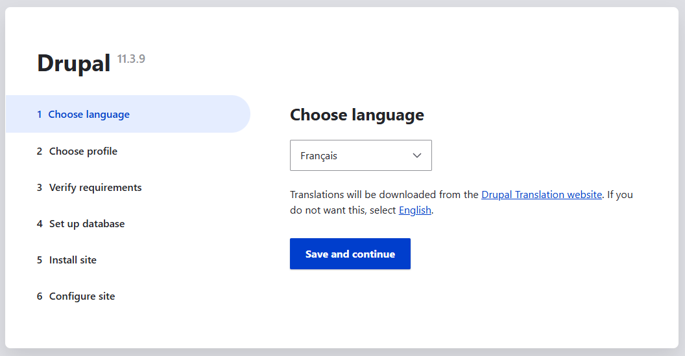
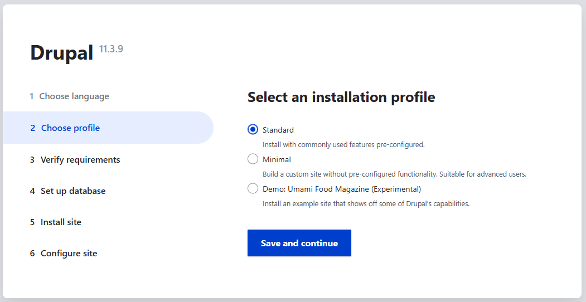
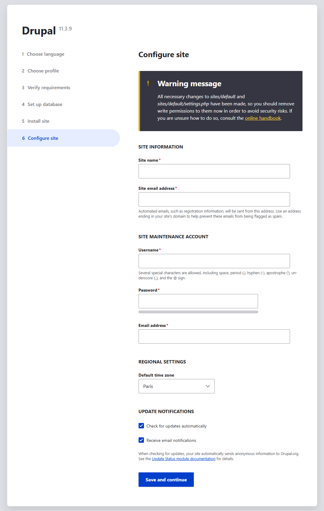
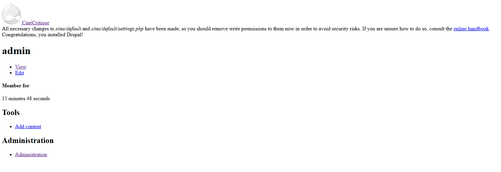

# 💧 Initialisation du site Drupal

L'installation de **Drupal** via **Composer** avec la commande `create-project` ne constitue que la première étape du processus
de mise en place d'un site **Drupal** fonctionnel. Cette commande télécharge uniquement les fichiers source du framework et ses
dépendances **PHP**, mais elle ne crée pas encore un site opérationnel.

Pour finaliser cette installation, **Drupal** propose une interface graphique. 

Utilisez cette commande pour vous rendre sur l'interface d'installation :

```shell
ddev launch
```

## Les étapes de l'initialisation

Détaillons ensemble les étapes d'initialisation de **Drupal**.

### 1. Choose language


*Initialisation de Drupal - Choisir la langue*

Ce premier écran de l'initialisation de **Drupal** vous propose de sélectionner la langue, avec le français sélectionné par
défaut.

Bien qu'il soit tentant d'installer directement **Drupal** dans sa langue natale, je recommande de procéder à
l'installation initiale en anglais. Il est bien entendu possible de télécharger des packs de langues par la suite.

Les raisons sont :
- **Traductions incomplètes** : certains textes peuvent rester en anglais si les traductions ne sont pas à 100%.
- **Modules contribués** : beaucoup n'ont pas de traductions françaises disponibles immédiatement.
- **Formation simplifiée** : de nombreux tutos sont en anglais, il sera plus simple de suivre ces tutos avec une interface identique.
- **Debug plus simple** : les messages d'erreurs seront en anglais ce qui facilite la recherche sur **Google** ou la documentation.

Il n'y a pas vraiment de risque ou de problème à charger une autre langue que l'anglais. Je trouve juste cela plus pratique.

Je vous invite donc à choisir "English" dans la liste et de valider le formulaire en cliquant sur le bouton "Save and continue".

### 2. Choose profile


*Initialisation de Drupal - Choisir le profil*

Cet écran de l'initialisation nous propose de choisir quel profil d'installation nous souhaitons utiliser pour la configuration
de base de notre site. Chaque profil pré-configure différents modules, types de contenu, rôles utilisateurs et paramètres
selon un usage spécifique.

- **Standard** : configuration polyvalente avec des fonctionnalités courantes (articles, pages, commentaires, taxonomie).
  Idéal pour la plupart des sites web classiques.
- **Minimal** : installation très légère avec seulement les modules indispensables. Parfait lorsque l'on souhaite construire
  notre site de zéro.
- **Demo Umami Food Magazine** : site de démonstration pré-rempli avec du contenu d'exemple. Utile pour découvrir les
  possibilités de Drupal ou comme base pour un site magazine.

Par défaut le profil **Standard** s'impose. Mais je préfère installer un site en **Minimal** pour avoir totalement le
contrôle sur les modules que nous souhaitons installer.

Et surtout, dans le cas où plusieurs développeurs auront à travailler sur le même projet **Drupal**, il faut pouvoir permettre
l'installation à partir des configurations existantes. Et ce n'est possible qu'en effectuant une installation minimale. (Sans avoir
à effectuer des modifications dans les fichiers de configs).

Choisissez "Minimal" et validez le formulaire en cliquant sur "Save and continue".

### 3. Verify requirements

Vous n'avez rien à faire durant cette étape. Elle est d'ailleurs automatiquement validée.

### 4. Set up database

Lors de l'installation du projet avec **DDEV**, les informations de connexion à la base de données ont déjà été configurées
dans les fichiers *settings* de **Drupal**. Nous les analyserons plus en détail plus tard dans la formation.

Vous n'avez donc rien à faire durant cette étape.

### 5. Install site

Vous n'avez rien à faire durant cette étape. Elle est d'ailleurs automatiquement validée.

### 6. Configure site


*Initialisation de Drupal - Configurer le site*

Dernière étape de l'initialisation de notre projet Drupal.

Il ne reste plus qu'à indiquer les informations de notre site internet. Vous pouvez saisir les informations suivantes : 

* **Site name** : MonProjet
* **Site email address** : contact@mon-projet.com (pas besoin que l'adresse mail soit valide car on utilisera un catcher de mail)
* **SITE MAINTENANCE ACCOUNT**
  * **Username** : admin
  * **Password** : password (nous sommes en local, pas besoin que le mot de passe soit sécurisé)
  * **Confirm password** : password
  * **Email address** : admin@mon-projet.com (Ici aussi il n'est pas nécessaire que l'adresse mail soit valide)
* **REGIONAL SETTINGS**
  * **Default time zone** : Paris
* **UPDATE NOTIFICATIONS** :
  * Check for updates automatically : Activez cette option pour recevoir des notifications de mise à jour automatique.
  * Receive email notifications : Comme nous sommes en local, il n'est pas nécessaire d'activer cette option.

Une fois les informations entrées, validez le formulaire en cliquant sur "Save and continue".

## Félicitation


*Initialisation de Drupal - Fin d'installation*

Votre site **Drupal** est désormais installé et initialisé... et il est **très moche** !

Mais ne vous inquiétez pas, c'est tout à fait normal. N'oubliez pas que nous avons effectué une installation minimale.
Nous n'avons donc pas de contenu, ni de templates, ni de modules, etc..
