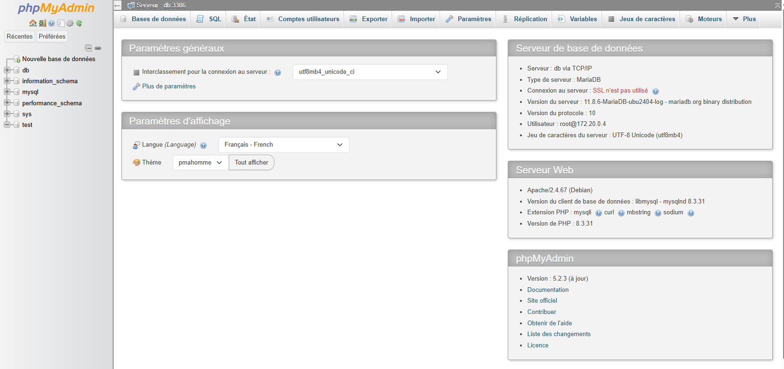

# 🗄️PHPMyAdmin

## C'est quoi PHPMyAdmin ?

**PHPMyAdmin** est une application web gratuite et open-source qui permet de gérer vos bases de données **MySQL** et **MariaDB** 
depuis une interface graphique accessible via votre navigateur.

**PHPMyAdmin** est particulièrement utile dans les cas suivants :

* 🔍 **Déboguer** : vérifier rapidement si une donnée a bien été enregistrée en base.
* 📦 **Sauvegarder** : exporter une base de données avant une mise à jour ou une migration.
* 🚀 **Déployer** : importer une base de données sur un serveur distant.
* 🧪 **Expérimenter** : tester des requêtes SQL avant de les intégrer dans votre code.
* 👀 **Comprendre** : explorer la structure d'un projet existant pour comprendre comment les données sont organisées.

**PHPMyAdmin** est un outil d'administration et de consultation très pratique dans le développement de bases de données.

::: danger ⚠️ PHPMyAdmin ne doit pas être utilisé en production !
**PHPMyAdmin** est un outil de développement et de test, il ne doit pas être exposé en production pour des raisons de sécurité.
Il offre un accès direct à l'ensemble de votre base de données via une simple interface web. Même protégé par un mot de passe, 
il reste une cible privilégiée des attaques.
:::

## Installation

Comme nous utiliserons **PHPMyAdmin** dans notre environnement local, nous allons utiliser **DDEV** pour l'installer.
Et c'est un jeu d'enfant !

Dans le terminal, utilisez la commande suivante : 

```shell
ddev add-on get ddev/ddev-phpmyadmin
```

Cette commande va générer le service et vous proposer de nouvelles commandes.

Une fois l'installation terminée, redémarrez **DDEV** pour que le service soit disponible :

```shell
ddev restart
```

Une fois l'installation terminée, avec la commande `ddev describe`, vous devriez voir **PHPMyAdmin** dans la liste : 

```shell
├──────────────┼──────┼──────────────────────────────────────────┼───────────┤
│ phpmyadmin   │ OK   │ http://cinecritique.ddev.site:8036       │           │
│              │      │ InDocker:                                │           │
│              │      │  - phpmyadmin:80                         │           │
├──────────────┼──────┼──────────────────────────────────────────┼───────────┤
```

Et pour vous rendre sur l'interface web de **PHPMyAdmin**, utilisez la commande suivante :

```shell
ddev phpmyadmin
```


*Dashboard de PHPMyAdmin*

**DDEV** a automatiquement utilisé les informations de configuration de votre projet pour configurer **PHPMyAdmin** !

::: info Configurer Xdebug
Dans le prochain chapitre, nous allons configurer un autre outil indispensable pour le développement : 
[Xdebug](/drupal-project/installation/xdebug)
:::