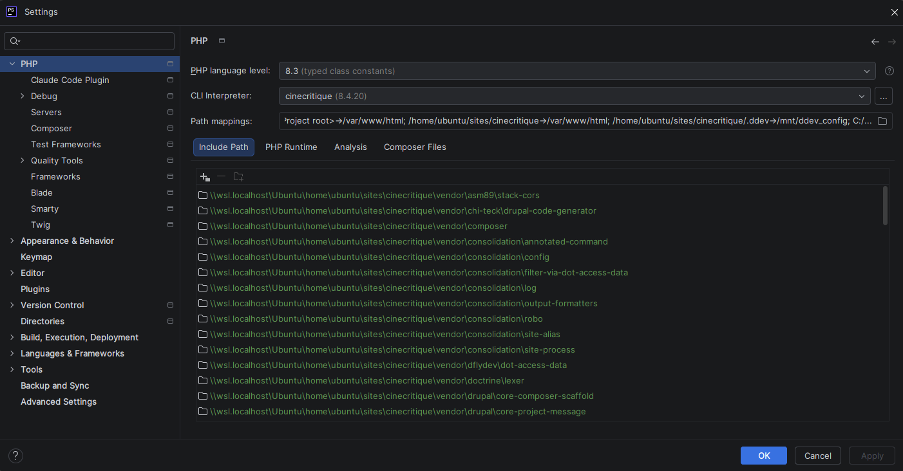
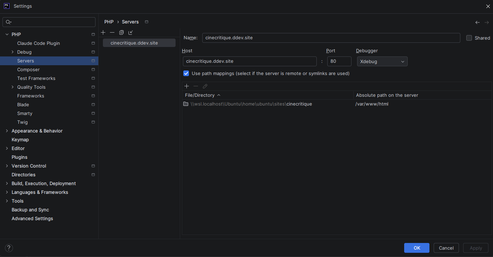
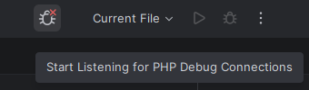

# 🐛 Xdebug

## C'est quoi Xdebug ?

[Xdebug](https://xdebug.org/) est une **extension PHP** qui fournit des fonctionnalités de débogage et de profilage
pour vos applications PHP. C'est l'outil indispensable de tout développeur PHP.

Concrètement, Xdebug permet de :

- **Poser des points d'arrêt** (breakpoints) dans votre code pour stopper l'exécution à un endroit précis.
- **Inspecter les variables** en temps réel : voir leur valeur, leur type, leur contenu.
- **Exécuter le code pas à pas** (step into, step over, step out) pour suivre le flux d'exécution.
- **Analyser la pile d'appels** (call stack) pour comprendre comment on est arrivé à un endroit du code.
- **Profiler les performances** pour identifier les goulots d'étranglement.

::: tip Adieu var_dump() et dump() !
Avec Xdebug, vous n'avez plus besoin de placer des `var_dump()`, `dump()` ou `dd()` partout dans votre code pour
comprendre ce qu'il se passe. Vous pouvez inspecter n'importe quelle variable directement depuis votre IDE, à
n'importe quel moment de l'exécution.
:::

## DDEV et Xdebug

Bonne nouvelle : **DDEV intègre Xdebug nativement**. Vous n'avez rien à installer ni à configurer côté serveur. **Xdebug**
est déjà présent dans le conteneur web, prêt à être utilisé.

Par défaut, **Xdebug** est **désactivé** pour des raisons de performances. Il suffit de l'activer quand vous en avez
besoin.

**DDEV** propose plusieurs commandes pour gérer **Xdebug** :

```shell
# Activer Xdebug
ddev xdebug on

# Désactiver Xdebug
ddev xdebug off

# Vérifier l'état actuel de Xdebug
ddev xdebug status
```

::: tip Pensez à désactiver Xdebug quand vous ne l'utilisez pas
**Xdebug** a un impact significatif sur les performances. Votre site sera sensiblement plus lent quand **Xdebug** est activé. 
Pensez à le désactiver dès que vous avez terminé votre session de débogage. 
:::

## Configuration dans PHPStorm

Si vous avez installé le plugin **DDEV Integration**, vous n'avez presque rien à faire !

Le plugin a automatiquement configuré **PHPStorm**. Vérifions ça ensemble.

Dans *Settings -> PHP*, sélectionnez `cinecritique (8.4.20)` en tant que `CLI interpreter`.


*Settings PHP*

Dans *Settings -> PHP -> Servers*, vérifiez que `cinecritique.ddev.site` existe.


*Settings PHP Servers*

Il ne reste plus qu'à activer le débogage en cliquant sur `Start Listening for PHP Debug Connections` dans la barre 
supérieure de **PHPStorm**.


*Icône de debug*

**PHPStorm** est prêt à utiliser **Xdebug**.

Pour tester, lancez **PHPStorm** et ouvrez le fichier `index.php` de votre projet. Placez un point d'arrêt sur la 
première ligne du fichier et lancez le débogage. Vous devriez voir le point d'arrêt s'activer lorsque vous accédez à 
l'URL de votre site dans votre navigateur.

Pour arrêter le débogage, cliquez à nouveau sur l'icône de debug et désactivez **Xdebug** dans **DDEV** :

```shell
ddev xdebug off
```

**Xdebug** est également disponible lors d'utilisation des lignes de commande **Drush**. Par défaut **Drush** désactive
**Xdebug** pour des raisons de performance. Pour utiliser **Xdebug** avec **Drush**, rajoutez le flag `--xdebug` à votre
commande :

```shell
# Afficher les différences de configuration entre la base de données 
# et les fichiers de config en activant le debug
ddev drush cst --xdebug
```

::: info Toujours plus d'outils de développement !
Après **PHPMyAdmin** et **Xdebug**, je vous propose d'installer un trio d'outil qui vont nous permettre
de vérifier et améliorer la qualité de notre code : [PHPUnit, PHPStan et Code Sniffer](/drupal-project/installation/code_quality)
:::